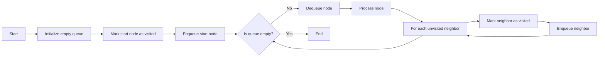
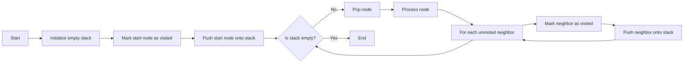
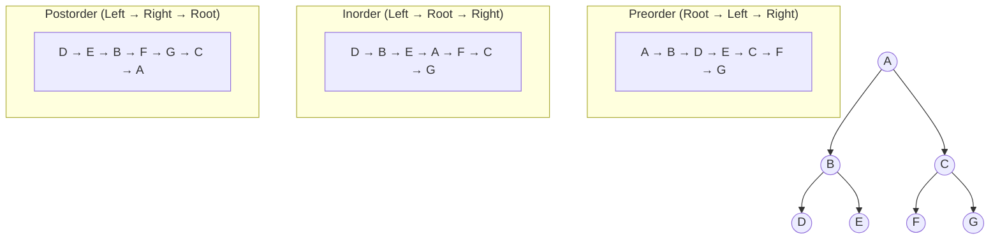
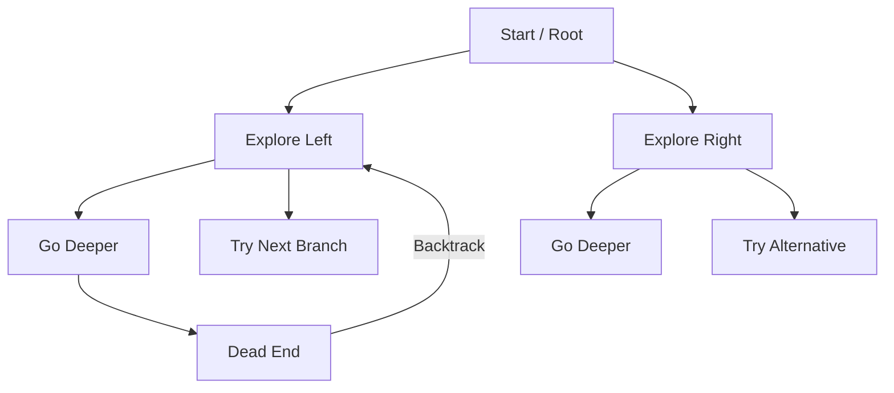
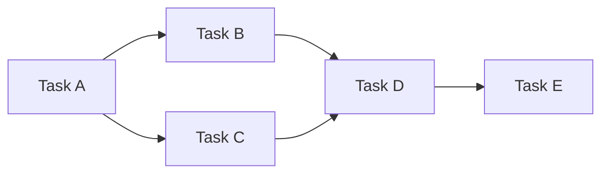
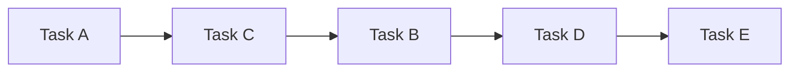
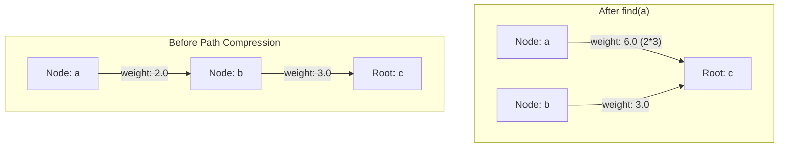

# LeetCode Notes

These are my notes collated from my Obsidian Notebook for all the patterns and learnings I have taken from tackling LeetCode questions.

> \[!NOTE]
> There are still some patterns left,
> - Pattern for how to find permutation and combinations

### Two Pointer

Instead of checking every combination of possibilities, we can instead use two pointers. This is a common pattern to spot two pointer problems. We have two types of two pointer problems :

#### 1. Two pointers both go from left to right
Ideal for processing data in one pass, for example a fast and slow pointer problem for detecting cycles in linked list.

#### 2. One starts on left, other starts on right
Typically used in problems where we’re finding pairs or comparing elements from opposite ends of the data structure. A classic example is [Two Sum II](https://leetcode.com/problems/two-sum-ii-input-array-is-sorted/description), where we need to find which two numbers sum up to target in a sorted array.

### Sliding Window

Is similar to two pointer, but is more focused. Maintains a window of elements dynamically adjusting its size while iterating. Goal is to manage a range or subset of elements that satisfy a specific condition, like subarray / substring. For example, to find longest substring with unique characters in a string.

Extremely powerful for tracking contiguous sequences like strings subarrays or linked lists

Often combined with hash maps to keep track of elements inside the window

```
left = -1

for right_pointer_index in len(array):
	logic
	while condition != met:
		update left pointer
```

### Breadth-First Search

Graph traversal algorithm that explores nodes level by level, it checks a node, and the nodes neighbors, before exploring within the node.

BFS uses a **queue** data structure


### Depth-First Search

Graph traversal algorithm that explores as far as possible along one branch before backtracking. It fully explores a node  before moving to its neighbor.
	
DFS uses a **stack** data structure (or recursion, which uses the call stack).


> [!note]
> We mark nodes as visited when a cycle is possible, a binary search tree for example a cycle is not possible and therefore, marking as visited is unnecessary

### Order traversal



```python title="ordered traversal"
def preorder(node):
    """
    Preorder: Root -> Left -> Right
    """
    if node is None:
        return

    visit(node)
    preorder(node.left)
    preorder(node.right)


def inorder(node):
    """
    Inorder: Left -> Root -> Right
    """
    if node is None:
        return

    inorder(node.left)
    visit(node)
    inorder(node.right)


def postorder(node):
    """
    Postorder: Left -> Right -> Root
    """
    if node is None:
        return

    postorder(node.left)
    postorder(node.right)
    visit(node)

```

### Backtracking

Is an extension on depth first search. 



Often have to build the structure ourselves unlike in DFS, especially in combinatorial problems for example. When finding combinations of an array, even though a tree exists, it’s not an actual structure we can iterate through. Our tree is generated dynamically as we make decisions.

We make a series of decisions, each decision represents a node in the tree and each potential decision forms a branch as you explore a decision you either reach a valid solution or hit a dead end. When you hit a dead end, backtrack and undo the decision and make a different decision.

```
BACKTRACK(state):
    if is_solution(state):
        record_solution(state) or return solution
        return

    for choice in choices(state):
        if is_valid(choice, state):
            apply(choice, state)
            BACKTRACK(state)
            undo(choice, state)
```

[Letter Combinations of a Phone Number](https://leetcode.com/problems/letter-combinations-of-a-phone-number/description/) is a good example of a question that uses backtracking, given n numbers on a keypad we need to find every combination of letters we can make.

for [Leetcode 129. Sum Root to Leaf Numbers](https://leetcode.com/problems/sum-root-to-leaf-numbers/description/?envType=study-plan-v2&envId=top-interview-150) I used this approach:

```python title="tracking state in backtracking"
def sumNumbers(self, root: Optional[TreeNode]) -> int:

	def Backtrack(node, number):
		if not (node.left or node.right):
			return number

		total = 0

		for child in (node.left, node.right):
			if child:
				total += Backtrack(child, number * 10 + child.val)
		
		return total

return Backtrack(root, root.val)
```

Notice the use of a total variable to keep track of the sum, this is how values can be recorded when iterating with the Backtracking pattern

### Priority Heap

When we see questions related to Kth largest, frequent, smallest, closest values, we should think of using a priority queue, most commonly a [[Data Structures#Heaps]].

We use a min heap to find the K largest values and a max heap to find the K smallest values.

# Array / String

## 6. Zigzag Conversion
The string `"PAYPALISHIRING"` is written in a zigzag pattern on a given number of rows like this: (you may want to display this pattern in a fixed font for better legibility)

```
P   A   H   N
A P L S I I G
Y   I   R
```
And then read line by line: `"PAHNAPLSIIGYIR"`

Write the code that will take a string and make this conversion given a number of rows:

string convert(string s, int numRows);

**Example 1:**

**Input:** s = "PAYPALISHIRING", numRows = 3
**Output:** "PAHNAPLSIIGYIR"

**Example 2:**
**Input:** s = "PAYPALISHIRING", numRows = 4
**Output:** "PINALSIGYAHRPI"
**Explanation:**
```
P     I    N
A   L S  I G
Y A   H R
P     I
```
### Solution
If you look at the first row, it increments by 6 to get to the next value, this is because the distance is $2 * (rows - 1)$. This works because we’re going in a sort of V formation, up to down and then up. Same thing for the last row, we always increment by $2 * (rows - 1)$. However, the middle rows don’t do that, the second row in example 2 goes in a pattern of 4-2-4-2.  This is because they don’t form a clean V shape. Although we can go in the same increment as the first and last row, we might miss a few values, the values we miss are at the distance $r * 2$, where $r$ is the row we are currently finding.

## 42. Trapping Rain Water
Given `n` non-negative integers representing an elevation map where the width of each bar is `1`, compute how much water it can trap after raining.

**Example 1:**


**Input:** height = \[0,1,0,2,1,0,1,3,2,1,2,1]
**Output:** 6
**Explanation:** The above elevation map (black section) is represented by array \[0,1,0,2,1,0,1,3,2,1,2,1]. In this case, 6 units of rain water (blue section) are being trapped.

**Example 2:**
**Input:** height = \[4,2,0,3,2,5]
**Output:** 9

### Solution
The trick to this question is taking a two pointer approach. We will have an index on the left, and an index on the right. And we will store the max value the left and right pointer have seen so far. For whichever max is lower, we will update it by bringing it closer to the center, we will subtract the new index from the max value and if it is non negative, we can store the difference of the subtraction in that position. All of this until the left and right pointer cross each other.  This uses the logic that, the water is limited by the smaller value, so by storing the biggest value, we know the value we will see is smaller and we know it cant cross the threshold.

## 134. Gas Station
There are `n` gas stations along a circular route, where the amount of gas at the `ith` station is `gas[i]`.
You have a car with an unlimited gas tank and it costs `cost[i]` of gas to travel from the `ith` station to its next `(i + 1)th` station. You begin the journey with an empty tank at one of the gas stations.
Given two integer arrays `gas` and `cost`, return _the starting gas station's index if you can travel around the circuit once in the clockwise direction, otherwise return_ `-1`. If there exists a solution, it is **guaranteed** to be **unique**.

**Example 1:**
**Input:** gas = \[1,2,3,4,5], cost = \[3,4,5,1,2]
**Output:** 3
**Explanation:**
Start at station 3 (index 3) and fill up with 4 unit of gas. Your tank = 0 + 4 = 4
Travel to station 4. Your tank = 4 - 1 + 5 = 8
Travel to station 0. Your tank = 8 - 2 + 1 = 7
Travel to station 1. Your tank = 7 - 3 + 2 = 6
Travel to station 2. Your tank = 6 - 4 + 3 = 5
Travel to station 3. The cost is 5. Your gas is just enough to travel back to station 3.
Therefore, return 3 as the starting index.

### Solution
First thing we do is make a diff vector, that has the difference between the gas and the cost. For example : \[-2, -2, -2, 3, 3]. From the diff vector, we will iterate left to right keeping track of the total, if the total ever falls below 0, we know that that index and every index to its left CANNOT be the starting index, because no matter where it starts from, it’ll hit negative gas. If we have an index, and we keep iterating and reach the end of the vector without the total falling below 0, we know it is the starting point. This is because from that point onwards, the total never falls below 0, and there is guarantee’d to be only one unique solution. One note, is that its possible for there to be no solution, for example if the diff is \[-9999, 2, 3]. Starting from index 1 in this example, we would reach the end but we can never complete this because the cost to reach index 0 is too high. For this reason, we need to verify that the solution is possible by summing up the diff and seeing if it is above 0 or not, this tells us if there is a solution at all or not.

## 135. Candy
There are `n` children standing in a line. Each child is assigned a rating value given in the integer array `ratings`.
You are giving candies to these children subjected to the following requirements:
- Each child must have at least one candy.
- Children with a higher rating get more candies than their neighbors.
Return _the minimum number of candies you need to have to distribute the candies to the children_.

**Example 1:**
**Input:** ratings = \[1,0,2]
**Output:** 5
**Explanation:** You can allocate to the first, second and third child with 2, 1, 2 candies respectively.

### Solution
I think the trick to this question is doing 2-passes, going forward and going backward. Initialize a vector with all children having 1 candy, then go forward and add candy to a child if its neighbor to the left is a lower rating. After this, do a backward pass, where a child gets more candy than their neighbor to the right if their rating is higher.


# Matrix

## Traversal Pattern

```python title="Visited vertical and horizontal neighbor patter"
def bfs(row,col):
	queue = deque([(row,col)])
	visited.add((row,col))
	
	while queue:
		curr_row, curr_col = queue.popleft()
		for dr, dc in [(0,1), (0,-1), (1,0), (-1,0)]:
			nr, nc = curr_row + dr, curr_col + dc
			if (0 <= nr < rows and 0 <= nc < cols) and grid[nr][nc] == "1" and (nr, nc) not in visited:
				queue.append((nr, nc))
				visited.add((nr, nc)
```

Look at the use of the static list with directions

## 36. Valid Sudoku
Determine if a `9 x 9` Sudoku board is valid. Only the filled cells need to be validated **according to the following rules**:

1. Each row must contain the digits `1-9` without repetition.
2. Each column must contain the digits `1-9` without repetition.
3. Each of the nine `3 x 3` sub-boxes of the grid must contain the digits `1-9` without repetition.

**Note:**
- A Sudoku board (partially filled) could be valid but is not necessarily solvable.
- Only the filled cells need to be validated according to the mentioned rules.

**Example 1:**


**Input:** board = 
```
[["5","3",".",".","7",".",".",".","."]
,["6",".",".","1","9","5",".",".","."]
,[".","9","8",".",".",".",".","6","."]
,["8",".",".",".","6",".",".",".","3"]
,["4",".",".","8",".","3",".",".","1"]
,["7",".",".",".","2",".",".",".","6"]
,[".","6",".",".",".",".","2","8","."]
,[".",".",".","4","1","9",".",".","5"]
,[".",".",".",".","8",".",".","7","9"]]
Output: true
```

### Solution
This is a good question to learn traversing a matrix. Look at these patterns :

```python title="iterating through rows"
for row in board:
	valid_row = [i for i in row if i.isdigit()]
	if len(set(valid_row)) != len(valid_row):
		return False
```

```python title="iterating through columns"
for i in range(len(board)):
	valid_col = [digit for digit in [row[i] for row in board] if digit.isdigit()]
	if len(set(valid_col)) != len(valid_col):
		return False
```

```python title="grabbing every 3x3 grid"
for x in range(1, len(board), 3):
	for y in range(1, len(board), 3):
		valid_square = set()
		# LOOK AT THE MASTERFUL USE OF THESE LIST LITERALS
		for i in [-1, 0, 1]:
			for j in [-1, 0, 1]:
				char = board[x+i][y+j]
				
				if not char.isdigit():
					continue
				elif char in valid_square:
					return False
				else:
					valid_square.add(char)
```

## 54. Spiral Matrix 

Given an `m x n` `matrix`, return _all elements of the_ `matrix` _in spiral order_.

**Example 1:**


**Input:** matrix = \[\[1,2,3],\[4,5,6],\[7,8,9]]
**Output:** \[1,2,3,6,9,8,7,4,5]

**Example 2:**


**Input:** matrix = \[\[1,2,3,4],\[5,6,7,8],\[9,10,11,12]]
**Output:** \[1,2,3,4,8,12,11,10,9,5,6,7]

### Solution

Look at the use of a 4 corner approach here for this spiral traversal

```python title="4 corner approach for matrix spirals"
class Solution:
    def spiralOrder(self, matrix: List[List[int]]) -> List[int]:
        result = []
        m, n = len(matrix), len(matrix[0])
        top, bottom, left, right = 0, m - 1, 0, n - 1

        while top <= bottom and left <= right:
            for i in range(left, right + 1):
                result.append(matrix[top][i])
            top += 1

            for i in range(top, bottom + 1):
                result.append(matrix[i][right])
            right -= 1

            if top <= bottom:
                for i in range(right, left - 1, -1):
                    result.append(matrix[bottom][i])
                bottom -= 1

            if left <= right:
                for i in range(bottom, top - 1, -1):
                    result.append(matrix[i][left])
                left += 1

        return result
```

## 289. Game of Life

According to [Wikipedia's article](https://en.wikipedia.org/wiki/Conway%27s_Game_of_Life): "The **Game of Life**, also known simply as **Life**, is a cellular automaton devised by the British mathematician John Horton Conway in 1970."

The board is made up of an `m x n` grid of cells, where each cell has an initial state: **live** (represented by a `1`) or **dead** (represented by a `0`). Each cell interacts with its [eight neighbors](https://en.wikipedia.org/wiki/Moore_neighborhood) (horizontal, vertical, diagonal) using the following four rules (taken from the above Wikipedia article):

1. Any live cell with fewer than two live neighbors dies as if caused by under-population.
2. Any live cell with two or three live neighbors lives on to the next generation.
3. Any live cell with more than three live neighbors dies, as if by over-population.
4. Any dead cell with exactly three live neighbors becomes a live cell, as if by reproduction.

The next state of the board is determined by applying the above rules simultaneously to every cell in the current state of the `m x n` grid `board`. In this process, births and deaths occur **simultaneously**.

Given the current state of the `board`, **update** the `board` to reflect its next state.

**Note** that you do not need to return anything.

**Example 1:**


**Input:** board = \[\[0,1,0],\[0,0,1],\[1,1,1],\[0,0,0]]
**Output:** \[\[0,0,0],\[1,0,1],\[0,1,1],\[0,1,0]]

### Solution

What is tricky about this question is getting in O(1) space, but it is possible by using encoding.

| Original | New | Encoded Value |
| -------- | --- | ------------- |
| 0        | 0   | 0             |
| 1        | 0   | 1             |
| 0        | 1   | 2             |
| 1        | 1   | 3             |

Now in the first loop, we can change the values to the encoded values and while looping we will know what their previous value was, and in the second loop (to normalize it to 0s and 1s) we will know what the new value of the cell should be.

> [!note]
> We are not going in the actual truth table format, in binary we go: 0, 2, 1, 3. But this is because it makes the logic easier, the encoded value is the same as the original value this way

There is also a pattern here to iterate through each neighbor of a cell

```python title="count neighbors for a cell"
def count_neighbors(r, c, board, rows, cols):
    """
    Count the number of living neighbors around cell (r, c).

    A neighbor is any cell in the 3x3 area centered on (r, c),
    excluding the cell itself and any out-of-bounds positions.
    """

    neighbors = 0

    # Iterate through the 3x3 square centered at (r, c)
    for i in range(r - 1, r + 2):
        for j in range(c - 1, c + 2):

            # Skip out-of-bounds cells
            if i < 0 or i >= rows or j < 0 or j >= cols:
                continue

            # Skip the cell itself
            if i == r and j == c:
                continue

            # Count living neighbors
            # (1 = alive, 3 = alive but marked to die)
            if board[i][j] == 1 or board[i][j] == 3:
                neighbors += 1

    return neighbors
```


# Linked Lists

## Reverse a linked list

You know the problem description.

### Solution

I remember distinctly I had to reimplement this for my ex in her CSE 232 class junior year college  and I couldn't, it was aura loss. Later, I asked Soham how to do it and he too forgot. Anyways, the pattern I think to keep in mind is holding the previous value in a temporary variable while you iterate through the linked list. So you:
1) hold the previous node
2) hold the next node
3) make `curr->next` = previous node
4) make `curr` = next node

## LRU Cache

Design a data structure that follows the constraints of a **[Least Recently Used (LRU) cache](https://en.wikipedia.org/wiki/Cache_replacement_policies#LRU)**.

Implement the `LRUCache` class:

- `LRUCache(int capacity)` Initialize the LRU cache with **positive** size `capacity`.
- `int get(int key)` Return the value of the `key` if the key exists, otherwise return `-1`.
- `void put(int key, int value)` Update the value of the `key` if the `key` exists. Otherwise, add the `key-value` pair to the cache. If the number of keys exceeds the `capacity` from this operation, **evict** the least recently used key.

The functions `get` and `put` must each run in `O(1)` average time complexity.

**Example 1:**

**Input**
\["LRUCache", "put", "put", "get", "put", "get", "put", "get", "get", "get"]
\[\[2], \[1, 1], \[2, 2], \[1], \[3, 3], \[2], \[4, 4], \[1], \[3], \[4]]
**Output**
\[null, null, null, 1, null, -1, null, -1, 3, 4]

**Explanation**
```
LRUCache lRUCache = new LRUCache(2);
lRUCache.put(1, 1); // cache is {1=1}
lRUCache.put(2, 2); // cache is {1=1, 2=2}
lRUCache.get(1);    // return 1
lRUCache.put(3, 3); // LRU key was 2, evicts key 2, cache is {1=1, 3=3}
lRUCache.get(2);    // returns -1 (not found)
lRUCache.put(4, 4); // LRU key was 1, evicts key 1, cache is {4=4, 3=3}
lRUCache.get(1);    // return -1 (not found)
lRUCache.get(3);    // return 3
lRUCache.get(4);    // return 4
```

### Solution

Linked lists have O(1) deletion and insertion if you don't have to iterate through, you can overcome iterating through the linked list with a dictionary. I think I struggled with this before because I didn't think to use the dictionary creatively by storing nodes from the double linked list

```python title="attributes for the LRU Cache"
class LRUCache:

    def __init__(self, capacity: int):
        self.capacity = capacity

        # cache: Dict[int, Node]
        #   key   -> int (the cache key)
        #   value -> Node (node in the doubly linked list holding key & value)
        self.cache = {}

        # Dummy head and tail nodes for the doubly linked list
        self.head = Node()
        self.tail = Node()
        self.head.next = self.tail
        self.tail.prev = self.head
```

# Binary Tree

> [!note]
> There is a difference between a Binary Tree and a Binary Search Tree, learn the difference.
>
> [[Data Structures#Binary Trees]] vs [[Data Structures#Binary Search Trees (BST)]]

# Binary Search Tree

Read about properties of a [[Data Structures#Binary Search Trees (BST)]]
## Inorder Traversal of a Binary Search Tree

```
INORDER(node)
    if node is null
        return

    INORDER(node.left)
    visit(node)
    INORDER(node.right)
```

# Graph General

## Topological Sort

Topological sort is the idea that you can model using a graph that different things depend on each other. 
- Topological sorting for Directed Acyclic Graph (DAG) is a linear ordering of vertices such that for every directed edge u→v, vertex u comes before v in the ordering. 
- There may be several topological orderings for a graph.
- Applies only to DAGs (Directed Acyclic Graphs), and is not possible for cyclic or undirected graphs





### Kahn’s Algorithm

Efficient method to in O(V + E) return nodes in a topologically sorted order

```python title="Kahn's Algorithm"
def topoSort(adj):
    n = len(adj)
    indegree = [0] * n
    res = []
    queue = deque()

    # Compute indegrees
    for i in range(n):
        for next_node in adj[i]:
            indegree[next_node] += 1
            
    # Add all nodes with indegree 0 into the queue
    for i in range(n):
        if indegree[i] == 0:
            queue.append(i)

    # Kahn’s Algorithm
    while queue:
        top = queue.popleft()
        res.append(top)
        for next_node in adj[top]:
            indegree[next_node] -= 1
            if indegree[next_node] == 0:
                queue.append(next_node)

    return res
```

If all indegrees are 0 at the end then graph is acyclic and a topological sort is valid.
## 399. Evaluate Division
You are given an array of variable pairs equations and an array of real numbers values, where equations\[i] = \[Ai, Bi] and values\[i] represent the equation Ai / Bi = values\[i]. Each Ai or Bi is a string that represents a single variable.

You are also given some queries, where queries\[j] = \[$C_j$, $D_j$] represents the $jth$ query where you must find the answer for $C_j$ / $D_j$ = ?.

Return the answers to all queries. If a single answer cannot be determined, return -1.0.

Note: The input is always valid. You may assume that evaluating the queries will not result in division by zero and that there is no contradiction.

Note: The variables that do not occur in the list of equations are undefined, so the answer cannot be determined for them.

Example 1:

Input: equations = \[\["a","b"],\["b","c"]], values = \[2.0,3.0], queries = \[\["a","c"],\["b","a"],\["a","e"],\["a","a"],\["x","x"]]
Output: \[6.00000,0.50000,-1.00000,1.00000,-1.00000]
Explanation: 
Given: a / b = 2.0, b / c = 3.0
queries are: a / c = ?, b / a = ?, a / e = ?, a / a = ?, x / x = ? 
return: \[6.0, 0.5, -1.0, 1.0, -1.0 ]
note: x is undefined => -1.0

Example 2:

Input: equations = \[\["a","b"],\["b","c"],\["bc","cd"]], values = \[1.5,2.5,5.0], queries = \[\["a","c"],\["c","b"],\["bc","cd"],\["cd","bc"]]
Output: \[3.75000,0.40000,5.00000,0.20000]

Example 3:

Input: equations = \[\["a","b"]], values = \[0.5], queries = \[\["a","b"],\["b","a"],\["a","c"],\["x","y"]]
Output: \[0.50000,2.00000,-1.00000,-1.00000]

### Solution
Many things can be converted to a graph for example in this question, fraction multiplication is converted to a graph traversal question. In the most efficient solve, the problem even comes down to constructing a graph that is optimized for our particular use case, over here we group the graphs so that we don’t even need to perform a graph traversal

```python title="solution"
class Solution:
    def calcEquation(self, equations: list[list[str]], values: list[float], queries: list[list[str]]) -> list[float]:
        root = {}
        weight = {}

        def find(i):
            if i not in root:
                root[i] = i
                weight[i] = 1.0
            if root[i] != i:
                original_parent = root[i]
                root[i] = find(original_parent)
                weight[i] *= weight[original_parent]
            return root[i]

        def union(i, j, value):
            root_i, root_j = find(i), find(j)
            if root_i != root_j:
                root[root_i] = root_j
                weight[root_i] = value * weight[j] / weight[i]

        for (a, b), val in zip(equations, values):
            union(a, b, val)

        results = []
        for a, b in queries:
            if a not in root or b not in root or find(a) != find(b):
                results.append(-1.0)
            else:
                results.append(weight[a] / weight[b])
        
        return results
```



