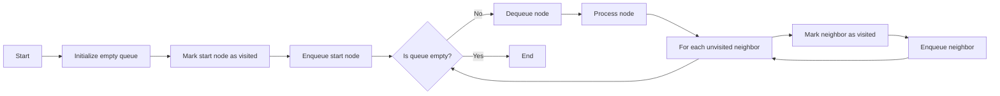
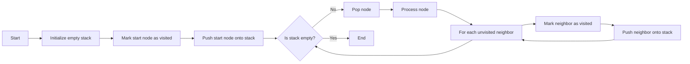
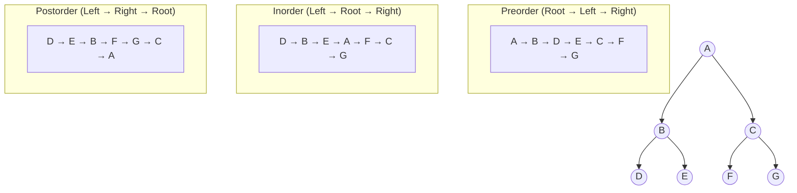
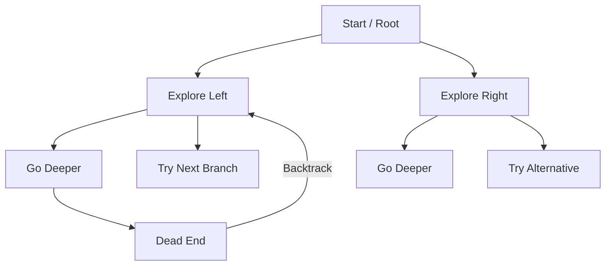
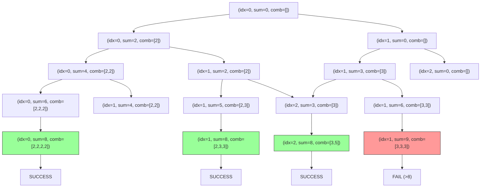
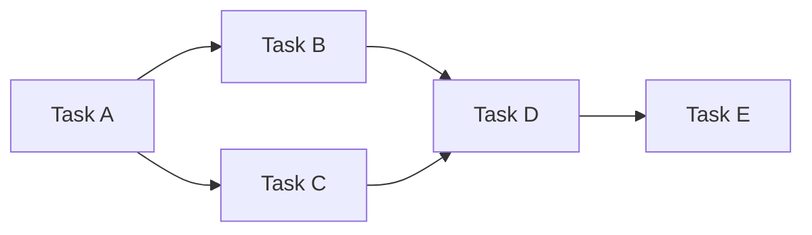
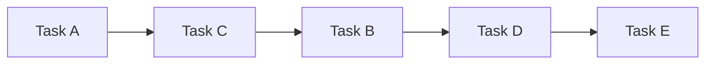
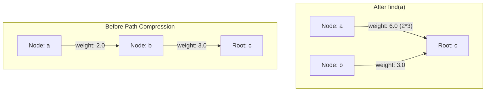

# LeetCode Notes

These are my notes collated from my Obsidian Notebook for all the patterns and learnings I have taken from tackling LeetCode questions.

# Integer / Bit Manipulation

#TODO 

There is a lot you can do with the binary representation of numbers, for example check for divisibility or odd/even or iterate through each digit of a number

This question is a good example for iterating through each digit of a binary number, a naive approach would convert the number to a string
https://leetcode.com/problems/binary-number-with-alternating-bits

# Two Pointer

Instead of checking every combination of possibilities, we can instead use two pointers. This is a common pattern to spot two pointer problems. We have two types of two pointer problems :
## 1. Two pointers both go from left to right
Ideal for processing data in one pass, for example a fast and slow pointer problem for detecting cycles in linked list.
## 2. One starts on left, other starts on right
Typically used in problems where we’re finding pairs or comparing elements from opposite ends of the data structure. A classic example is [Two Sum II](https://leetcode.com/problems/two-sum-ii-input-array-is-sorted/description), where we need to find which two numbers sum up to target in a sorted array.

# Sliding Window

Is similar to two pointer, but is more focused. Maintains a window of elements dynamically adjusting its size while iterating. Goal is to manage a range or subset of elements that satisfy a specific condition, like subarray / substring. For example, to find longest substring with unique characters in a string.

Extremely powerful for tracking contiguous sequences like strings subarrays or linked lists

Often combined with hash maps to keep track of elements inside the window

```
left = -1

for right_pointer_index in len(array):
	logic
	while condition != met:
		update left pointer
```

# Breadth-First Search

Graph traversal algorithm that explores nodes level by level, it checks a node, and the nodes neighbors, before exploring within the node.

BFS uses a **queue** data structure

```mermaid
flowchart LR
    A[Start] --> B[Initialize empty queue]
    B --> C[Mark start node as visited]
    C --> D[Enqueue start node]
    D --> E{Is queue empty?}
    E -- No --> F[Dequeue node]
    F --> G[Process node]
    G --> H[For each unvisited neighbor]
    H --> I[Mark neighbor as visited]
    I --> J[Enqueue neighbor]
    J --> H
    H --> E
    E -- Yes --> K[End]
```

# Depth-First Search

Graph traversal algorithm that explores as far as possible along one branch before backtracking. It fully explores a node  before moving to its neighbor.

DFS uses a **stack** data structure (or recursion, which uses the call stack).

```mermaid
flowchart LR
    A[Start] --> B[Initialize empty stack]
    B --> C[Mark start node as visited]
    C --> D[Push start node onto stack]
    D --> E{Is stack empty?}
    E -- No --> F[Pop node]
    F --> G[Process node]
    G --> H[For each unvisited neighbor]
    H --> I[Mark neighbor as visited]
    I --> J[Push neighbor onto stack]
    J --> H
    H --> E
    E -- Yes --> K[End]
```

> [!note]
> We mark nodes as visited when a cycle is possible, a binary search tree for example a cycle is not possible and therefore, marking as visited is unnecessary

# Order traversal


```mermaid
flowchart TB
    A((A))
    B((B))
    C((C))
    D((D))
    E((E))
    F((F))
    G((G))

    A --> B
    A --> C
    B --> D
    B --> E
    C --> F
    C --> G


subgraph Preorder["Preorder (Root → Left → Right)"]
	P1["A → B → D → E → C → F → G"]
end

subgraph Inorder["Inorder (Left → Root → Right)"]
	I1["D → B → E → A → F → C → G"]
end

subgraph Postorder["Postorder (Left → Right → Root)"]
	O1["D → E → B → F → G → C → A"]
end
```

```python title="ordered traversal"
def preorder(node):
    """
    Preorder: Root -> Left -> Right
    """
    if node is None:
        return

    visit(node)
    preorder(node.left)
    preorder(node.right)


def inorder(node):
    """
    Inorder: Left -> Root -> Right
    """
    if node is None:
        return

    inorder(node.left)
    visit(node)
    inorder(node.right)


def postorder(node):
    """
    Postorder: Left -> Right -> Root
    """
    if node is None:
        return

    postorder(node.left)
    postorder(node.right)
    visit(node)

```

# Backtracking

Is an extension on depth first search. 


```mermaid
flowchart TD
    R[Start / Root]
    
    R --> A[Explore Left]
    A --> B[Go Deeper]
    B --> C[Dead End]
    
    C -->|Backtrack| A
    A --> D[Try Next Branch]
    
    R --> E[Explore Right]
    E --> F[Go Deeper]
    E --> G[Try Alternative]

```

Often have to build the structure ourselves unlike in DFS, especially in combinatorial problems for example. When finding combinations of an array, even though a tree exists, it’s not an actual structure we can iterate through. Our tree is generated dynamically as we make decisions.

We make a series of decisions, each decision represents a node in the tree and each potential decision forms a branch as you explore a decision you either reach a valid solution or hit a dead end. When you hit a dead end, backtrack and undo the decision and make a different decision.

```
BACKTRACK(state):
    if is_solution(state):
        record_solution(state) or return solution
        return

    for choice in choices(state):
        if is_valid(choice, state):
            apply(choice, state)
            BACKTRACK(state)
            undo(choice, state)
```

[Letter Combinations of a Phone Number](https://leetcode.com/problems/letter-combinations-of-a-phone-number/description/) is a good example of a question that uses backtracking, given n numbers on a keypad we need to find every combination of letters we can make.


## 129. Sum Root to Leaf Numbers

[Link](https://leetcode.com/problems/sum-root-to-leaf-numbers/description/)

Notice the use of a total variable to keep track of the sum, this is how values can be recorded when iterating with the Backtracking pattern

```python title="tracking state in backtracking"
def sumNumbers(self, root: Optional[TreeNode]) -> int:
	def Backtrack(node, number):
		if not (node.left or node.right):
			return number

		total = 0

		for child in (node.left, node.right):
			if child:
				total += Backtrack(child, number * 10 + child.val)
		
		return total

return Backtrack(root, root.val)
```

## 46. Permutations 

[Link](https://leetcode.com/problems/permutations/description/)

Exploring backtracking doesn’t always have to be a vector. Over here we use swaps to explore each permutation

```cpp title="exploring decision tree with swaps"
class Solution {
public:
    void backtracking(vector<int>& nums, vector<vector<int>>& results, int start) {
        if (start == nums.size()) {
            results.push_back(nums);
            return;
        }

        for (int i = start; i < nums.size(); ++i) {
            swap(nums[start], nums[i]);
            backtracking(nums, results, start + 1);
            swap(nums[start], nums[i]);
        }
    }

    vector<vector<int>> permute(vector<int>& nums) {
        vector<vector<int>> results;
        backtracking(nums, results, 0);
        return results;
    }
};
```

## 39. Combination Sum

We want to form our decision tree this way to avoid duplicate combinations (the same sum with the same numbers just selected in a different order)


```mermaid
graph TD
    %% Root node
    Root["(idx=0, sum=0, comb=[])"]

    %% Level 1: idx=0 (Value 2)
    Root --> L1_Take2["(idx=0, sum=2, comb=[2])"]
    Root --> L1_Skip2["(idx=1, sum=0, comb=[])"]

    %% Level 2: From Take 2
    L1_Take2 --> L2_Take22["(idx=0, sum=4, comb=[2,2])"]
    L1_Take2 --> L2_Skip2["(idx=1, sum=2, comb=[2])"]

    %% Level 2: From Skip 2
    L1_Skip2 --> L2_Take3["(idx=1, sum=3, comb=[3])"]
    L1_Skip2 --> L2_Skip3["(idx=2, sum=0, comb=[])"]

    %% Level 3: From 2,2
    L2_Take22 --> L3_Take222["(idx=0, sum=6, comb=[2,2,2])"]
    L2_Take22 --> L3_Skip2["(idx=1, sum=4, comb=[2,2])"]

    %% Level 3: From 2 (skip to 3)
    L2_Skip2 --> L3_Take23["(idx=1, sum=5, comb=[2,3])"]
    L2_Skip2 --> L3_Skip3["(idx=2, sum=2, comb=[2])"]

    %% Level 3: From 3
    L2_Take3 --> L3_Take33["(idx=1, sum=6, comb=[3,3])"]
    L2_Take3 --> L3_Skip3["(idx=2, sum=3, comb=[3])"]

    %% Level 4: Found first solution [2,2,2,2]
    L3_Take222 --> L4_Take2222["(idx=0, sum=8, comb=[2,2,2,2])"]
    style L4_Take2222 fill:#9f9,stroke:#333
    L4_Take2222 --> Found1["SUCCESS"]

    %% Level 4: Found second solution [2,3,3]
    L3_Take23 --> L4_Take233["(idx=1, sum=8, comb=[2,3,3])"]
    style L4_Take233 fill:#9f9,stroke:#333
    L4_Take233 --> Found2["SUCCESS"]

    %% Level 4: Found third solution [3,5]
    L3_Skip3 --> L4_Take35["(idx=2, sum=8, comb=[3,5])"]
    style L4_Take35 fill:#9f9,stroke:#333
    L4_Take35 --> Found3["SUCCESS"]

    %% Example of pruning/backtracking
    L3_Take33 --> L4_Take333["(idx=1, sum=9, comb=[3,3,3])"]
    style L4_Take333 fill:#f99,stroke:#333
    L4_Take333 --> Fail["FAIL (>8)"]
```

```cpp title="decision tree without duplicates"
void makeCombination(std::vector<int>& candidates, int target, int idx, vector<int>& comb, int total, vector<vector<int>>& res) {
	if (total == target) {
		res.push_back(comb);
		return;
	}

	if (total > target || idx >= candidates.size()) {
		return;
	}

	comb.push_back(candidates[idx]);
	makeCombination(candidates, target, idx, comb, total + candidates[idx], res);
	comb.pop_back();
	makeCombination(candidates, target, idx + 1, comb, total, res);
}
```

## Priority Heap

When we see questions related to $K$th largest, frequent, smallest, closest values, we should think of using a priority queue, most commonly a [[Data Structures#Heaps]].

We use a min heap to find the K largest values and a max heap to find the $K$ smallest values.

# Array / String

## 6. Zigzag Conversion

[here](https://leetcode.com/problems/zigzag-conversion/description/)

If you look at the first row, it increments by 6 to get to the next value, this is because the distance is $2 * (rows - 1)$. This works because we’re going in a sort of V formation, up to down and then up. Same thing for the last row, we always increment by $2 * (rows - 1)$. However, the middle rows don’t do that, the second row in example 2 goes in a pattern of 4-2-4-2.  This is because they don’t form a clean V shape. Although we can go in the same increment as the first and last row, we might miss a few values, the values we miss are at the distance $r * 2$, where $r$ is the row we are currently finding.

## 42. Trapping Rain Water

[here](https://leetcode.com/problems/trapping-rain-water/description/)

The trick to this question is taking a two pointer approach. We will have an index on the left, and an index on the right. And we will store the max value the left and right pointer have seen so far. For whichever max is lower, we will update it by bringing it closer to the center, we will subtract the new index from the max value and if it is non negative, we can store the difference of the subtraction in that position. All of this until the left and right pointer cross each other.  This uses the logic that, the water is limited by the smaller value, so by storing the biggest value, we know the value we will see is smaller and we know it cant cross the threshold.

## 134. Gas Station

[here](https://leetcode.com/problems/gas-station/description/)

First thing we do is make a diff vector, that has the difference between the gas and the cost. For example : `[-2, -2, -2, 3, 3]`. From the diff vector, we will iterate left to right keeping track of the total, if the total ever falls below 0, we know that that index and every index to its left CANNOT be the starting index, because no matter where it starts from, it’ll hit negative gas. If we have an index, and we keep iterating and reach the end of the vector without the total falling below 0, we know it is the starting point. This is because from that point onwards, the total never falls below 0, and there is guaranteed to be only one unique solution. One note, is that its possible for there to be no solution, for example if the diff is `[-9999, 2, 3]`. Starting from index 1 in this example, we would reach the end but we can never complete this because the cost to reach index 0 is too high. For this reason, we need to verify that the solution is possible by summing up the diff and seeing if it is above 0 or not, this tells us if there is a solution at all or not.

## 135. Candy

[here](https://leetcode.com/problems/candy/description/)

The trick to this question is doing 2-passes, going forward and going backward. Initialize a vector with all children having 1 candy, then go forward and add candy to a child if its neighbor to the left is a lower rating. After this, do a backward pass, where a child gets more candy than their neighbor to the right if their rating is higher.

# Matrix

Look at the use of the static list with directions to traverse the matrix here

```python title="Visited vertical and horizontal neighbor patter"
def bfs(row,col):
	queue = deque([(row,col)])
	visited.add((row,col))
	
	while queue:
		curr_row, curr_col = queue.popleft()
		for dr, dc in [(0,1), (0,-1), (1,0), (-1,0)]:
			nr, nc = curr_row + dr, curr_col + dc
			if (0 <= nr < rows and 0 <= nc < cols) and grid[nr][nc] == "1" and (nr, nc) not in visited:
				queue.append((nr, nc))
				visited.add((nr, nc)
```

## 36. Valid Sudoku

[here](https://leetcode.com/problems/valid-sudoku/description/)

This is a good question to learn traversing a matrix. Look at these patterns:

```python title="iterating through rows"
for row in board:
	valid_row = [i for i in row if i.isdigit()]
	if len(set(valid_row)) != len(valid_row):
		return False
```

```python title="iterating through columns"
for i in range(len(board)):
	valid_col = [digit for digit in [row[i] for row in board] if digit.isdigit()]
	if len(set(valid_col)) != len(valid_col):
		return False
```

```python title="grabbing every 3x3 grid"
for x in range(1, len(board), 3):
	for y in range(1, len(board), 3):
		valid_square = set()
		# LOOK AT THE MASTERFUL USE OF THESE LIST LITERALS
		for i in [-1, 0, 1]:
			for j in [-1, 0, 1]:
				char = board[x+i][y+j]
				
				if not char.isdigit():
					continue
				elif char in valid_square:
					return False
				else:
					valid_square.add(char)
```

## 54. Spiral Matrix 

[here](https://leetcode.com/problems/spiral-matrix/description/)

Look at the use of a 4 corner approach here for this spiral traversal

```python title="4 corner approach for matrix spirals"
class Solution:
    def spiralOrder(self, matrix: List[List[int]]) -> List[int]:
        result = []
        m, n = len(matrix), len(matrix[0])
        top, bottom, left, right = 0, m - 1, 0, n - 1

        while top <= bottom and left <= right:
            for i in range(left, right + 1):
                result.append(matrix[top][i])
            top += 1

            for i in range(top, bottom + 1):
                result.append(matrix[i][right])
            right -= 1

            if top <= bottom:
                for i in range(right, left - 1, -1):
                    result.append(matrix[bottom][i])
                bottom -= 1

            if left <= right:
                for i in range(bottom, top - 1, -1):
                    result.append(matrix[i][left])
                left += 1

        return result
```

## 289. Game of Life

What is tricky about this question is getting $O(1)$ space, but it is possible by using encoding.

| Original | New | Encoded Value |
| -------- | --- | ------------- |
| 0        | 0   | 0             |
| 1        | 0   | 1             |
| 0        | 1   | 2             |
| 1        | 1   | 3             |
Now in the first loop, we can change the values to the encoded values and while looping we will know what their previous value was, and in the second loop (to normalize it to 0s and 1s) we will know what the new value of the cell should be.

> [!note]
> We are not going in the actual truth table format, in binary we go: 0, 2, 1, 3. But this is because it makes the logic easier, the encoded value is the same as the original value this way

There is also a pattern here to iterate through each neighbor of a cell

```python title="count neighbors for a cell"
def count_neighbors(r, c, board, rows, cols):
    """
    Count the number of living neighbors around cell (r, c).

    A neighbor is any cell in the 3x3 area centered on (r, c),
    excluding the cell itself and any out-of-bounds positions.
    """

    neighbors = 0

    # Iterate through the 3x3 square centered at (r, c)
    for i in range(r - 1, r + 2):
        for j in range(c - 1, c + 2):

            # Skip out-of-bounds cells
            if i < 0 or i >= rows or j < 0 or j >= cols:
                continue

            # Skip the cell itself
            if i == r and j == c:
                continue

            # Count living neighbors
            # (1 = alive, 3 = alive but marked to die)
            if board[i][j] == 1 or board[i][j] == 3:
                neighbors += 1

    return neighbors
```

# Linked Lists

## Reverse a linked list

I remember distinctly I had to reimplement this for my ex in her CSE 232 class junior year college and I couldn't, it was aura loss. Later, I asked Soham how to do it and he too forgot. Anyways, the pattern I think to keep in mind is holding the previous value in a temporary variable while you iterate through the linked list. So you:
1) hold the previous node
2) hold the next node
3) make `curr->next` = previous node
4) make `curr` = next node

# LRU Cache

Linked lists have $O(1)$ deletion and insertion if you don't have to iterate through, you can overcome iterating through the linked list with a dictionary. I think I struggled with this before because I didn't think to use the dictionary creatively by storing nodes from the double linked list

```python title="attributes for the LRU Cache"
class LRUCache:
    def __init__(self, capacity: int):
        self.capacity = capacity

        # cache: Dict[int, Node]
        #   key   -> int (the cache key)
        #   value -> Node (node in the doubly linked list holding key & value)
        self.cache = {}

        # Dummy head and tail nodes for the doubly linked list
        self.head = Node()
        self.tail = Node()
        self.head.next = self.tail
        self.tail.prev = self.head
```

# Binary Tree

> [!note]
> There is a difference between a Binary Tree and a Binary Search Tree, learn the difference.
>
> [[Data Structures#Binary Trees]] vs [[Data Structures#Binary Search Trees (BST)]]

# Binary Search Tree

Properties of a [[Data Structures#Binary Search Trees (BST)]]
## Inorder Traversal of a Binary Search Tree

```
INORDER(node)
    if node is null
        return

    INORDER(node.left)
    visit(node)
    INORDER(node.right)
```

# Graphs

## Topological Sort

Topological sort is the idea that you can model using a graph that different things depend on each other. 
- Topological sorting for Directed Acyclic Graph (DAG) is a linear ordering of vertices such that for every directed edge u→v, vertex u comes before v in the ordering. 
- There may be several topological orderings for a graph.
- Applies only to DAGs (Directed Acyclic Graphs), and is not possible for cyclic or undirected graphs


```mermaid
graph LR
    A[Task A] --> B[Task B]
    A --> C[Task C]
    B --> D[Task D]
    C --> D[Task D]
    D --> E[Task E]
```


```mermaid
graph LR
    A[Task A] --> C[Task C] --> B[Task B] --> D[Task D] --> E[Task E]
```

### Kahn’s Algorithm

Efficient method to in O(V + E) return nodes in a topologically sorted order

```python title="Kahn's Algorithm"
def topoSort(adj):
    n = len(adj)
    indegree = [0] * n
    res = []
    queue = deque()

    # Compute indegrees
    for i in range(n):
        for next_node in adj[i]:
            indegree[next_node] += 1
            
    # Add all nodes with indegree 0 into the queue
    for i in range(n):
        if indegree[i] == 0:
            queue.append(i)

    # Kahn’s Algorithm
    while queue:
        top = queue.popleft()
        res.append(top)
        for next_node in adj[top]:
            indegree[next_node] -= 1
            if indegree[next_node] == 0:
                queue.append(next_node)

    return res
```

If all indegrees are 0 at the end then graph is acyclic and a topological sort is valid.
## 399. Evaluate Division

[here](https://leetcode.com/problems/evaluate-division/description/)

Many things can be converted to a graph for example in this question, fraction multiplication is converted to a graph traversal question. In the most efficient solve, the problem even comes down to constructing a graph that is optimized for our particular use case, over here we group the graphs so that we don’t even need to perform a graph traversal

```python title="solution"
class Solution:
    def calcEquation(self, equations: list[list[str]], values: list[float], queries: list[list[str]]) -> list[float]:
        root = {}
        weight = {}

        def find(i):
            if i not in root:
                root[i] = i
                weight[i] = 1.0
            if root[i] != i:
                original_parent = root[i]
                root[i] = find(original_parent)
                weight[i] *= weight[original_parent]
            return root[i]

        def union(i, j, value):
            root_i, root_j = find(i), find(j)
            if root_i != root_j:
                root[root_i] = root_j
                weight[root_i] = value * weight[j] / weight[i]

        for (a, b), val in zip(equations, values):
            union(a, b, val)

        results = []
        for a, b in queries:
            if a not in root or b not in root or find(a) != find(b):
                results.append(-1.0)
            else:
                results.append(weight[a] / weight[b])
        
        return results
```


```mermaid
graph TD
    subgraph "After find(a)"
    A_flat[Node: a] -- "weight: 6.0 (2*3)" --> C_flat[Root: c]
    B_flat[Node: b] -- "weight: 3.0" --> C_flat
    end
	
    subgraph "Before Path Compression"
    A[Node: a] -- "weight: 2.0" --> B[Node: b]
    B -- "weight: 3.0" --> C[Root: c]
    end
```
